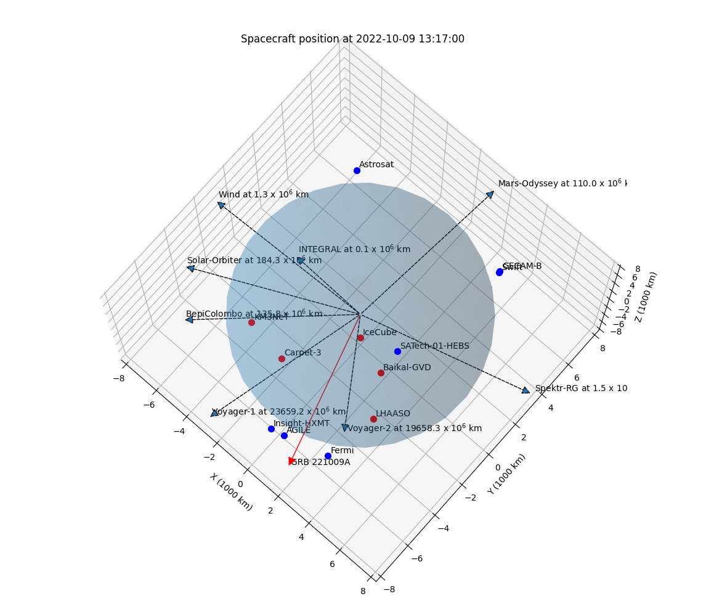

# GRB221009A

Propagation time delays relative to the Earth center.
Negative delay means that GRB reaches SC earlier than the center of Earth.
See `time_of_flight.py` for the calculation details.

| SC/Instrument    |   ToF (seconds) |
|------------------------------------|
|Fermi/GBM         |      -0.021     |
|Swift/BAT         |       0.015     |
|AGILE/MCAL        |      -0.021     |
|SATech-01/HEBS    |      -0.013     |
|Insight-HXMT/HE   |      -0.019     |
|GECAM-B/GRD       |       0.015     |
|INTEGRAL/SPI-ACS  |      -0.149     |
|Spektr-RG/ART-XC  |      -0.482     |
|Wind/Konus        |       1.248     |
|Mars-Odyssey/HEND |     236.482     |
|BepiColombo/MGNS  |     -95.662     |
|Solar-Orbiter/STIX|     -13.587     |
|Voyager-1         |  -68507.501     |

Script for producin 3d plot: plot_sc.py

